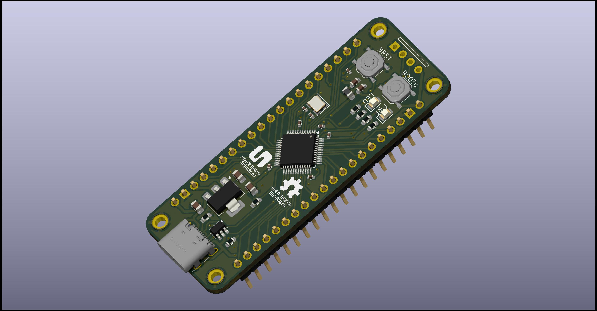

# STM32 Dev Board

This is a simple STM32 development board that I designed for my own use. It is based on the STM32F103C8T6 microcontroller. The design is inspired by the [Blue Pill][0] development board.

## Manufacturing

The board is designed to be manufactured using the [JLCPCB][1] assembly service. All the files required for manufacturing are in the `manufacturing` directory.

## Mechanical

The board is designed to be mounted in a 3D printed case. The case files are in the `case` directory or can be found on [Printables][2] and [Thingiverse][3].

The dimensions of the board are (L x W x H) 64mm x 24mm x 1.6mm.

The mounting holes are designed for [M2 ISO7380 screws][4].

[0]: https://stm32-base.org/boards/STM32F103C8T6-Blue-Pill.html
[1]: https://jlcpcb.com
[2]: https://www.thingiverse.com
[3]: https://www.printables.com
[4]: https://aliexpress.com/item/32810852732.html